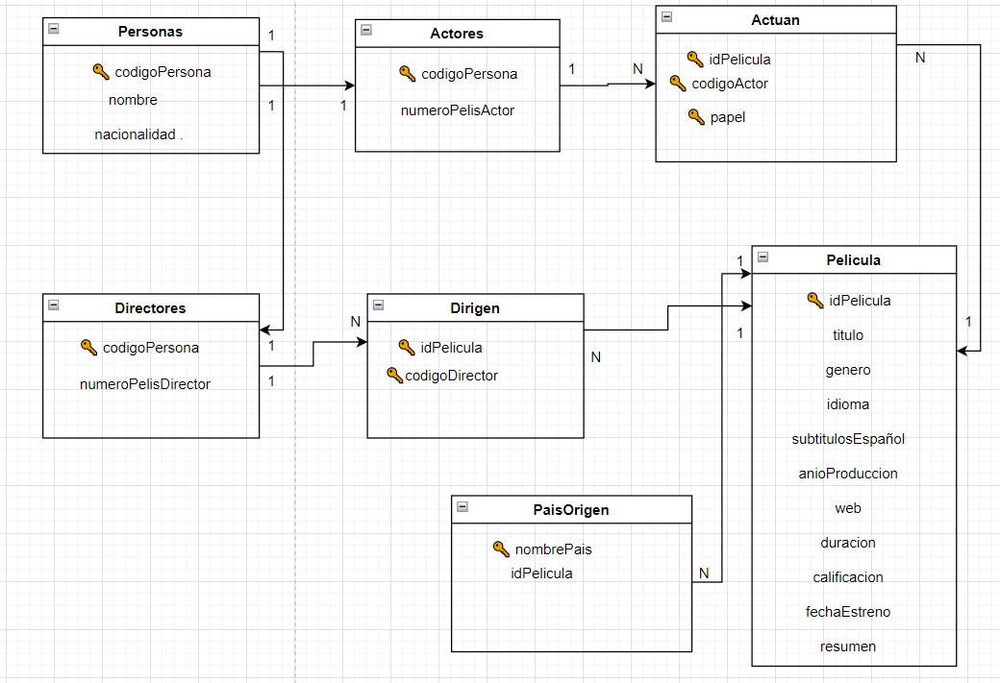

# Cristian_Ignacio_2023-BBDD-NoSQL
# Proyecto práctico con MongoDB

1. **Diseño de la base de datos**
    1. Identificar entidades
    2. Modelo lógico
2. **Diseñar schema**
3. **Crear docker-compose**
4. **Crear querys**
    1. Insertar varios documentos
    2. Fichero script con varioas ordenes
    3. Modificar documentos
    4. Eliminar documentos
# Diseño de la base de datos
## Identificar entidades
Las entidades elegidas para una base de datos cine son:  
**Personas**, que puede ser un **Actor** o **Director**, que **Director** puede dirigir una o varias **Peliculas**, Los **Actores** pueden actuar en una o varias **Peliculas** que puede tener uno o varios **Papeles** y **Pelicula** puede ser rodada en uno o varios **Paises**.  
## Modelo lógico


# Diseñar schema
```
yy
```
# Crear docker-compose
# Crear querys
